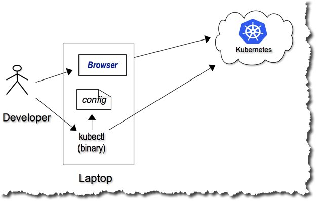
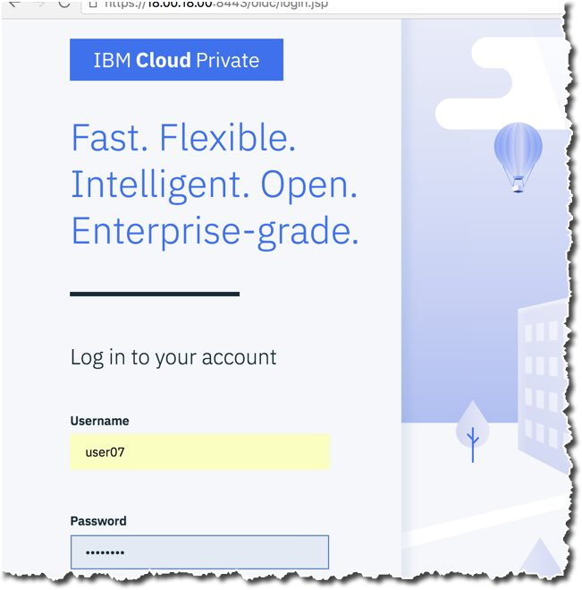
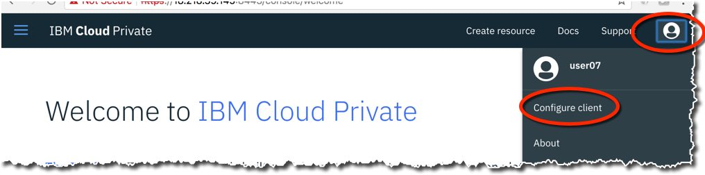
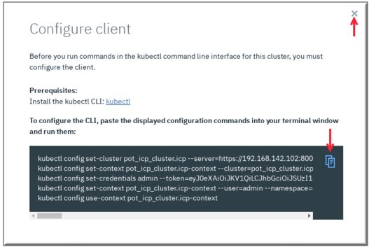

## Getting familiar with Kubernetes

In this section get a little familiar with Kubernetes by looking around the environment.

We'll use [IBM Cloud Private](https://www.ibm.com/cloud/learn/what-is-private-cloud) as our Kubernetes cluster for this session. We'll work together as a group on our shared cluster which currently runs in the cloud.




Now we're ready to take a closer look at our IBM Cloud Private Cluster. We can connect to our cluster with the browser and with the "kubectl" command line client. We'll spend most of our time with the command line client learning our kubernetes basics, but we'll use browser interface too. 

Let's start by getting a user and logging into the system. We'll start by taking a quick look at both and configuring our kubectl client.  

Start by going to the login page, and entering your username and password.



In the upper right corner click on the icon of a user and select configure client.




Click the copy button to capture details for configuring the kubectl client and paste the results at the command line.




The kubectl command line client should be configured.. just to check type

```

$ kubectl get deploy --namespace=default

```

Now you're connected to the cluster!


---
